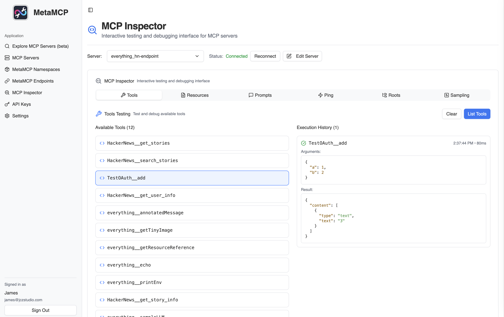

# 🚀 MetaMCP (Aggregate MCP servers & apply middlewares; host & emit unified MCP servers out)

<div align="center">

[](https://discord.gg/mNsyat7mFX)

</div>

**MetaMCP** is a MCP proxy that lets you dynamically aggregate MCP servers into a unified MCP server, and apply middlewares. MetaMCP itself is a MCP server so it can be easily plugged into **ANY** MCP clients.


## 📋 Table of Contents

- [🎯 Use Cases](#-use-cases)
- [📖 Concepts](#-concepts)
  - [🖥️ MCP Server](#️-mcp-server)
  - [🏷️ MetaMCP Namespace](#️-metamcp-namespace)
  - [🌐 MetaMCP Endpoint](#-metamcp-endpoint)
  - [⚙️ Middleware](#️-middleware)
  - [🔍 Inspector](#-inspector)
- [🚀 Quick Start](#-quick-start)
  - [🐳 Run with Docker Compose (Recommended)](#-run-with-docker-compose-recommended)
  - [💻 Local Development](#-local-development)
- [🔌 MCP Protocol Compatibility](#-mcp-protocol-compatibility)
- [❄️ Cold Start Problem and Custom Dockerfile](#️-cold-start-problem-and-custom-dockerfile)
- [🔐 Authentication](#-authentication)
- [🏗️ Architecture](#️-architecture)
  - [📊 Sequence Diagram](#-sequence-diagram)
- [🗺️ Roadmap](#️-roadmap)
- [🤝 Contributing](#-contributing)
- [📄 License](#-license)
- [🙏 Credits](#-credits)


## 🎯 Use Cases
- 🔄 **One-click server switching** - Save and switch MCP server configs for Claude Desktop, Cursor, or custom agents
- 🔍 **Enhanced MCP inspector** - Debug with saved server configurations  
- 🔗 **Unified server aggregation** - Join multiple servers for simplified agent development
- ⚡ **Dynamic tool management** - Quick toggles to enable/disable servers and tools
- 🛠️ **Middleware support** - Apply logging, error handling, and custom transformations
- 🎯 **Dynamic search rules** - Apply search rules and return different toolsets for agent builders

Generally developers can use MetaMCP as **infrastructure** to host dynamically composed MCP servers through a unified endpoint, and build agents on top of it.

Quick demo video: https://youtu.be/Cf6jVd2saAs



## 📖 Concepts

### 🖥️ **MCP Server**
A MCP server configuration that tells MetaMCP how to start a MCP server.

```json
"HackerNews": {
  "type": "STDIO",
  "command": "uvx",
  "args": ["mcp-hn"]
}
```

### 🏷️ **MetaMCP Namespace**
- Group one or more MCP servers into a namespace
- Enable/disable MCP servers or at tool level
- Apply middlewares to MCP requests and responses

### 🌐 **MetaMCP Endpoint**
- Create endpoints and assign namespace to endpoints
- Multiple MCP servers in the namespace will be aggregated and emitted as a MetaMCP endpoint
- Choose auth level and strategy
- Host through **SSE** or **Streamable HTTP** transports

### ⚙️ **Middleware**
- Intercepts and transforms MCP requests and responses at namespace level
- **Built-in example**: "Filter inactive tools" - optimizes tool context for LLMs
- **Future ideas**: tool logging, error traces, validation, scanning

### 🔍 **Inspector**
Similar to the official MCP inspector, but with **saved server configs** - MetaMCP automatically creates configurations so you can debug MetaMCP endpoints immediately.

## 🚀 Quick Start

### **🐳 Run with Docker Compose (Recommended)**

Clone repo, prepare `.env`, and start with docker compose:

```bash
git clone https://github.com/metatool-ai/metamcp.git
cd metamcp
cp example.env .env
docker compose up -d
```

### **💻 Local Development**

Still recommend running postgres through docker for easy setup:

```bash
pnpm install
pnpm dev
```

## 🔌 MCP Protocol Compatibility

- ✅ **Tools, Resources, and Prompts** supported
- ✅ **OAuth-enabled MCP servers** tested for 03-26 version

If you have questions, feel free to leave **GitHub issues** or **PRs**.

## ❄️ Cold Start Problem and Custom Dockerfile

⚠️ **Cold start issue** for hosting `stdio` type MCP servers:
- First run will be slow as package managers (uvx, npx) install dependencies
- Happens again on docker restart

🛠️ **Solution**: Customize the Dockerfile to add dependencies or pre-install packages to reduce cold start time.

## 🔐 Authentication

- 🛡️ **Better Auth** for frontend and backend (trpc procedures)
- 🍪 **Session cookies** enforce internal MCP proxy connections  
- 🔑 **API key auth** for external access via `Authorization: Bearer <api-key>` header
- Note though: the repo is not designed for multi-tenancy and each org should self-host an instance for org wide. E.g., MCP server has no user_id association, so every account have access to every MCP server configs hosted on the instance.

## 🏗️ Architecture

- **Frontend**: Next.js
- **Backend**: Express.js with tRPC, hosting MCPs through TS SDK and internal proxy
- **Auth**: Better Auth
- **Structure**: Standalone monorepo with Turborepo and Docker publishing

### 📊 Sequence Diagram

*Note: Prompts and resources follow similar patterns to tools.*

```mermaid
sequenceDiagram
    participant MCPClient as MCP Client (e.g., Claude Desktop)
    participant MetaMCP as MetaMCP Server
    participant MCPServers as Installed MCP Servers

    MCPClient ->> MetaMCP: Request list tools

    loop For each listed MCP Server
        MetaMCP ->> MCPServers: Request list_tools
        MCPServers ->> MetaMCP: Return list of tools
    end

    MetaMCP ->> MetaMCP: Aggregate tool lists & apply middleware
    MetaMCP ->> MCPClient: Return aggregated list of tools

    MCPClient ->> MetaMCP: Call tool
    MetaMCP ->> MCPServers: call_tool to target MCP Server
    MCPServers ->> MetaMCP: Return tool response
    MetaMCP ->> MCPClient: Return tool response
```

## 🗺️ Roadmap

**Potential next steps:**

- [ ] 🔌 Headless Admin API access
- [ ] 🔍 Dynamically apply search rules on MetaMCP endpoints
- [ ] 🛠️ More middlewares
- [ ] 💬 Chat/Agent Playground
- [ ] 🧪 Testing & Evaluation for MCP tool selection optimization
- [ ] ⚡ Dynamically generate MCP servers

## 🤝 Contributing

We welcome contributions! See details at **[CONTRIBUTING.md](CONTRIBUTING.md)**

## 📄 License

**MIT**

Would appreciate if you mentioned with back links if your projects use the code.

## 🙏 Credits

Some code inspired by:
- [MCP Inspector](https://github.com/modelcontextprotocol/inspector)
- [MCP Proxy Server](https://github.com/adamwattis/mcp-proxy-server)
